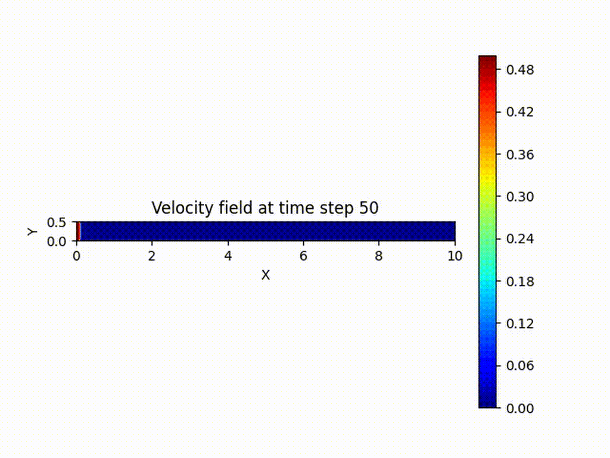
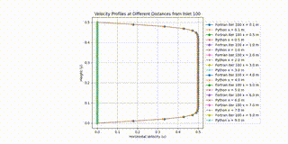

# Comparing Fortran and Python for 2D fluid Flow simulation

Here the CFD equations have been solved using FORTRAN and Python.
Everything was build using UBUNTU in a WSL2 environment. I used Xlaunch to be able to see the matplot figures in this environment.

To compile the fortran file do:

```gfortran -o fluid_simulation fluid_simulation.f90```

Then run the simulation with:

```./fluid_simulation```

While it runs it will dump the u v data in the folder results in the current working directory.

To obtain the results with Python, do:

```python pipeflow7.py```

This script will create the raw data and ouput frames figures it in the folders frames and data.

Finally, run `compare_fortran_python.py` to generate parabolic probiles at different distances for both simulations. The results after enought time both simulations converge to the same results. However, the Fortran code seems to converge faster than the one in python. 

To build the videos you can run:

```
 ffmpeg -framerate 10 -pattern_type glob -i 'frames/frame_*.png' -fps_mode vfr -c:v libx264 -pix_fmt yuv420p fluidflow_python.mp4
 ffmpeg -framerate 10 -pattern_type glob -i 'frames2/frame_*.png' -fps_mode vfr -c:v libx264 -pix_fmt yuv420p fluidflow_fortran.mp4
 ffmpeg -framerate 8 -pattern_type glob -i 'compareprofiles/frame_*.png' -fps_mode vfr -c:v libx264 -pix_fmt yuv420p parabolicprofiles_python_fortran.mp4
 ```

 To make *.gif files do

```
 ffmpeg -i fluidflow_python.mp4 -vf "fps=10,scale=1024:-1:flags=lanczos" -c:v gif fluidflow_python.gif
 ffmpeg -i fluidflow_fortran.mp4 -vf "fps=10,scale=1024:-1:flags=lanczos" -c:v gif fluidflow_fortran.gif
 ffmpeg -i parabolicprofiles_python_fortran.mp4  -vf "fps=10,scale=1024:-1:flags=lanczos" -c:v gif parabolicprofiles_python_fortran.gif
```

## Fluid flow with FORTRAN

## Fluid Flow with PYTHON

## Comparision of velocity profiles at different distances



