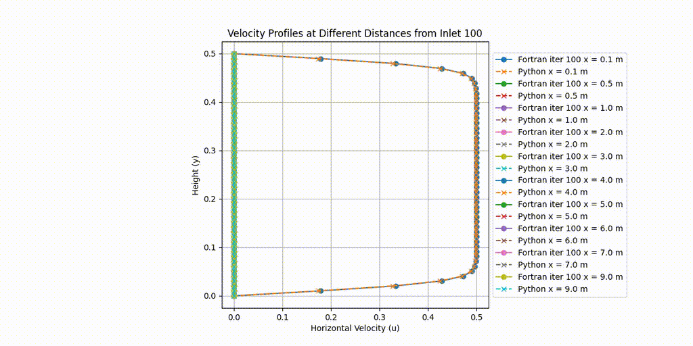

# Comparing Fortran and Python for 2D fluid Flow simulation

In this project, the CFD equations have been solved using both Fortran and Python. Everything was built using Ubuntu in a WSL2 environment. Xlaunch was used to view the matplotlib figures in this environment..
If you have any issues with VcXsrv X server, check this youtube video. https://www.youtube.com/watch?v=6_mbd1hvUnE

To compile the fortran file, run:

```gfortran -o fluid_simulation fluid_simulation.f90```

Then, run the simulation with:

```./fluid_simulation```

While it runs, it will dump the u and v data into the results folder in the current working directory.

To obtain the results using Python, run:

```python pipeflow7.py```

This script will create the raw data and output frame figures in the frames and data folders.

Finally, run compare_fortran_python.py to generate parabolic profiles at different distances for both simulations. After enough time, both simulations converge to the same results. However, the Fortran code seems to converge faster than the Python code.

To build the videos, you can run:

```
 ffmpeg -framerate 10 -pattern_type glob -i 'frames/frame_*.png' -fps_mode vfr -c:v libx264 -pix_fmt yuv420p fluidflow_python.mp4
 ffmpeg -framerate 10 -pattern_type glob -i 'frames2/frame_*.png' -fps_mode vfr -c:v libx264 -pix_fmt yuv420p fluidflow_fortran.mp4
 ffmpeg -framerate 8 -pattern_type glob -i 'compareprofiles/frame_*.png' -fps_mode vfr -c:v libx264 -pix_fmt yuv420p parabolicprofiles_python_fortran.mp4
 ```

To create GIF files, run:

```
 ffmpeg -i fluidflow_python.mp4 -vf "fps=10,scale=1024:-1:flags=lanczos" -c:v gif fluidflow_python.gif
 ffmpeg -i fluidflow_fortran.mp4 -vf "fps=10,scale=1024:-1:flags=lanczos" -c:v gif fluidflow_fortran.gif
 ffmpeg -i parabolicprofiles_python_fortran.mp4  -vf "fps=10,scale=1024:-1:flags=lanczos" -c:v gif parabolicprofiles_python_fortran.gif
```

## Fluid flow with FORTRAN

## Fluid Flow with PYTHON

## Comparision of velocity profiles at different distances



